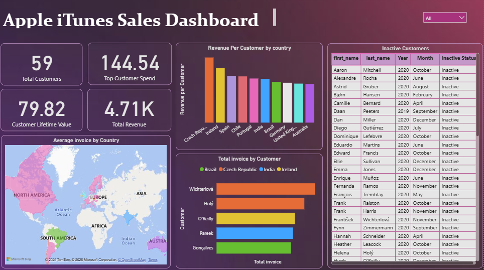
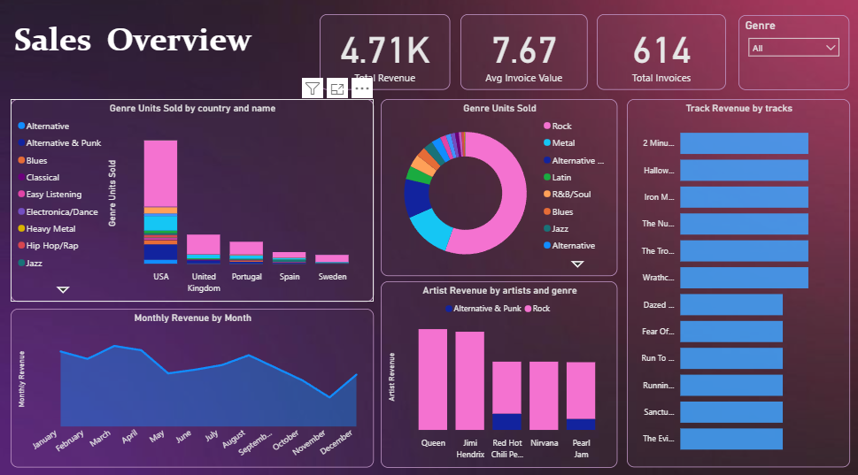

# Apple iTunes Sales Analysis Dashboard

## Project Overview

This project analyzes Apple iTunes sales data to understand customer behavior, revenue trends, and product performance. The goal is to extract meaningful business insights and present them through an interactive **Power BI dashboard**.

The project combines **SQL-based data analysis** with visualization to explore sales patterns across countries, genres, customers, and time.

---

## Problem Statement

Businesses require clear insights into customer purchasing behavior and revenue trends to improve decision-making.

This project aims to:

- Analyze sales performance across different regions  
- Identify top customers and revenue contributors  
- Understand genre-wise sales distribution  
- Track revenue trends over time  
- Highlight inactive customers  

---

## Tools & Technologies

- SQL (MySQL)  
- Power BI  
- Excel  

---

## Dataset

The dataset includes information about:

- Customers  
- Invoices  
- Tracks and albums  
- Genres and artists  
- Sales transactions  

The data was structured and queried using SQL before visualization.

---

## Project Workflow

### 1. Data Preparation
- Imported dataset into SQL database  
- Created tables for albums, tracks, employees, and customers  
- Inserted structured data using SQL scripts  

### 2. SQL Analysis
- Wrote queries to extract:
  - Customer revenue  
  - Sales trends  
  - Genre performance  
  - Top customers  

### 3. Dashboard Development
- Connected SQL data to Power BI  
- Built an interactive dashboard  
- Designed visuals for business insights  

---

## Key Metrics (KPIs)

- **Total Customers:** 59  
- **Total Revenue:** 4.71K  
- **Average Invoice Value:** 7.67  
- **Total Invoices:** 614  
- **Customer Lifetime Value:** 79.82  
- **Top Customer Spend:** 144.54  

---

## Dashboard Preview




---

## Key Insights

### Customer Analysis
- A small group of customers contributes significantly to total revenue  
- Identified high-value customers for targeted marketing  

---

### Revenue Trends
- Monthly revenue shows fluctuations with certain peak months  
- Indicates seasonal purchasing behavior  

---

### Genre Performance
- Rock and Alternative genres dominate sales  
- Genre preferences vary across countries  

---

### Geographic Insights
- Countries like the USA and European regions contribute major revenue  
- Revenue distribution varies significantly by location  

---

### Inactive Customers
- Several customers show inactivity over months  
- Opportunity for re-engagement strategies  

---

## Business Recommendations

- Focus on high-value customers through loyalty programs  
- Promote top-performing genres for higher revenue  
- Re-engage inactive customers with targeted campaigns  
- Analyze seasonal trends for better sales planning  

---

## Conclusion

This project demonstrates how SQL and Power BI can be combined to extract meaningful insights from sales data.

It showcases strong skills in:

- SQL querying  
- Business analysis  
- Dashboard development  
- Data-driven decision making  

---

## Repository Structure

```text
Apple-iTunes-Sales-Analysis
│
├── Apple iTunes Sales Analysis.pbix
├── Apple_iTunes.sql
├── insert_album_data.sql
├── insert_employee_data.sql
├── insert_track_data.sql
```
